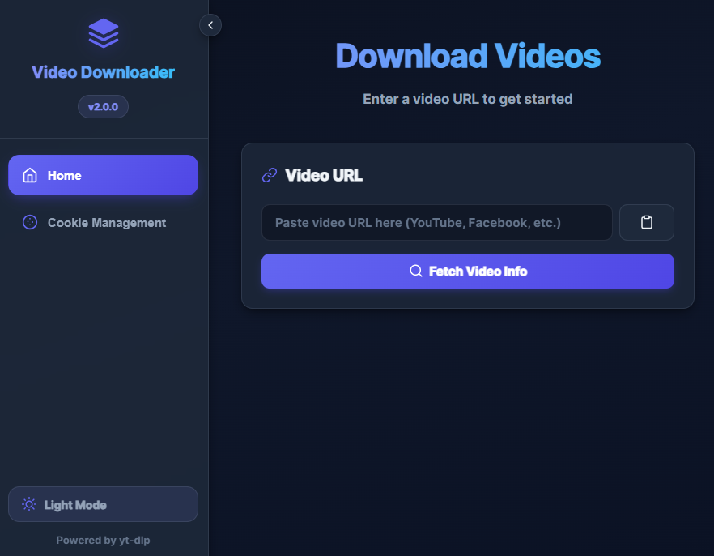
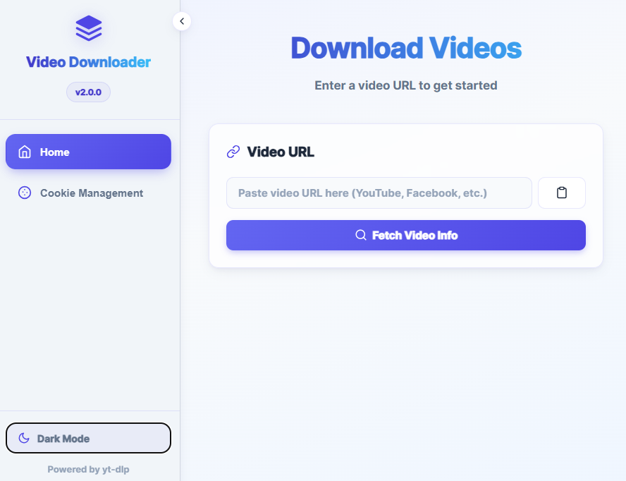

# Video Downloader v2.0.0


A modern, lightweight desktop application for downloading videos from YouTube, Facebook, Instagram, TikTok, and 1000+ websites — built on **Tauri + Rust**.

## What's new in 2.0.0

Version 2.0.0 is a full architectural rewrite: the app has migrated from **Electron** to **[Tauri](https://tauri.app/) + Rust**. The UI is unchanged (same React frontend), but everything that used to run in a bundled Node/Chromium process now runs as native Rust:

- **~10x smaller installers** — no bundled Chromium/Node runtime; the app uses the OS's native WebView (WebView2 on Windows, WebKitGTK on Linux, WKWebView on macOS).
- **Lower memory and CPU usage** at idle and during downloads.
- **A real, native installer on every platform** — including proper Linux packages instead of a single generic AppImage.

## Screenshots

| Dark mode                                     | Light mode                                      |
| --------------------------------------------- | ----------------------------------------------- |
|  |  |

## Installation

- **Latest release**: [Releases page](https://github.com/Rafat-Pantho/video-downloader/releases)

Download the installer for your platform:

[](https://github.com/Rafat-Pantho/video-downloader/releases/download/v2.0.0/Video-Downloader_2.0.0_x64-setup.exe)
[](https://github.com/Rafat-Pantho/video-downloader/releases/download/v2.0.0/Video-Downloader_2.0.0_x64.dmg)
[-.deb-E95420?logo=debian&logoColor=white>)](https://github.com/Rafat-Pantho/video-downloader/releases/download/v2.0.0/video-downloader_2.0.0_amd64.deb)
[-.AppImage-FCC624?logo=linux&logoColor=black>)](https://github.com/Rafat-Pantho/video-downloader/releases/download/v2.0.0/video-downloader_2.0.0_amd64.AppImage)

> Swap `<YOUR_GITHUB_USERNAME>` and `<YOUR_REPO_NAME>` for your actual GitHub username and repository name. Filenames follow Tauri's default bundle naming — verify them against the actual asset names on the [v2.0.0 release](https://github.com/Rafat-Pantho/video-downloader/releases/tag/v2.0.0) once the GitHub Actions build finishes, and update the links if they differ (e.g. `arm64` builds on Apple Silicon).

## Features

- **Native Tauri + Rust backend** — small, fast, and memory-light compared to Electron
- **Modern Dark UI** — sleek dark theme with glassmorphism cards, smooth hover/press states, and toast notifications instead of browser alerts
- **Authenticated Downloads** — download private/age-restricted videos from YouTube and Facebook by logging in through an embedded webview; session cookies are extracted directly from the webview and saved locally, no browser extension required
- **Cookie Management** — view, edit, and manage the cookies used for authenticated downloads
- **Multi-Platform Support** — YouTube, Facebook, Instagram, TikTok, Twitter/X, and 1000+ other sites via [yt-dlp](https://github.com/yt-dlp/yt-dlp)
- **Orientation-aware quality selection** — portrait clips (Reels/Shorts) are capped by true resolution, not raw frame height, so they're never needlessly downscaled or squished
- **Quality options** — 4K, 2K, 1080p, 720p, 480p, 360p, 240p, 144p, or Audio Only, dynamically detected per video
- **Multiple formats** — MP4, MKV, WebM, AVI (video) · MP3, M4A, Opus, FLAC, WAV (audio)
- **Real-time progress** — live download progress streamed from the Rust backend via Tauri events
- **Auto-update notifications** — checks GitHub releases for newer versions on launch

## Quick Start

1. **Download** the installer for your platform (see table above)
2. **Install** the application
3. **Paste** a video URL
4. **Click** "Fetch Video Info" to preview the video
5. **Select** quality and format
6. **Download!**

## Authenticated Downloads (private / age-restricted videos)

Some videos require you to be logged in to download — private videos, age-restricted content, and members-only posts. The app handles this with an embedded login flow instead of asking you to export cookies manually:

1. Open **Cookie Management** in the sidebar and click **Login** (or click **Login** when prompted after a failed download).
2. A popup window opens to the site's real login page. Sign in as you normally would.
3. Once the page has fully loaded after signing in, click **"I've Finished Logging In"**. This explicitly tells the app to snapshot the webview's session cookies — waiting for you to confirm avoids racing a fixed timer against the login redirect.
4. The app extracts the cookies straight from the webview's cookie store and saves them to `cookies.txt` in the app's local data directory, in the same Netscape format yt-dlp expects.
5. Return to **Home** and download — the saved cookies are automatically passed to yt-dlp for any download that needs them.

You can also click **Close Login Window** once you're done, and review or delete individual cookies from the Cookie Management page at any time.

## Supported Websites

YouTube, Facebook, Instagram, TikTok, Twitter/X, Vimeo, Dailymotion, Reddit, Twitch, and 1000+ more!

Full list: `https://github.com/yt-dlp/yt-dlp/blob/master/supportedsites.md`

## Development

### Prerequisites

- [Node.js](https://nodejs.org/) 18+ and npm
- [Rust](https://www.rust-lang.org/tools/install) (stable toolchain) and Cargo
- Platform-specific Tauri dependencies — see the [Tauri prerequisites guide](https://v2.tauri.app/start/prerequisites/):
  - **Windows**: WebView2 (preinstalled on Windows 10/11) and the Visual Studio Build Tools (C++ workload)
  - **macOS**: Xcode Command Line Tools
  - **Linux**: `libwebkit2gtk-4.1-dev`, `libgtk-3-dev`, `librsvg2-dev`, `libayatana-appindicator3-dev`, `build-essential`

### Setup

```bash
git clone https://github.com/Rafat-Pantho/video-downloader.git
cd video-downloader
npm install
```

`npm install` also downloads the bundled `yt-dlp` and `ffmpeg`/`ffprobe` binaries for your OS into `bin/` (via `download-ytdlp.js` / `download-ffmpeg.js`, run automatically as a postinstall step).

### Run in development

```bash
npm run tauri dev
```

This builds the React frontend with webpack and launches the app in a Tauri window with hot-reload.

### Build a release installer

```bash
npm run build
```

Produces a native installer for your current platform under `src-tauri/target/release/bundle/`.

## Project structure

- `src/` — React frontend (unchanged from the Electron version)
- `src-tauri/` — Rust backend: all Tauri commands (video info, downloads, cookie/login handling, update checks) live in `src-tauri/src/main.rs`
- `download-ytdlp.js` / `download-ffmpeg.js` — cross-platform binary downloaders run on `npm install`

## License

ISC License

## Credits

Powered by [yt-dlp](https://github.com/yt-dlp/yt-dlp) and [Tauri](https://tauri.app/)
